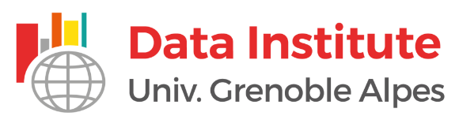

<style>
.column-left{
  float: left;
  width: 70%;
  text-align: left;
}
.column-right{
  float: right;
  width: 30%;
  text-align: right;
}
</style>


<div class="column-left">
I am a computational biologist specialized in experimental and theoritical genetics. 

In October 2018, I was recruited by the CNRS as a research associate (CRCN). I am currently working at the [TIMC-IMAG](https://www-timc.imag.fr/) laboratory in the [BCM](https://www-timc.imag.fr/BCM) team.


```{r, out.width = "500px", echo=FALSE, fig.align='left'}

```
</div>

<div class="column-right">
```{r, out.width = "200px", echo=FALSE, fig.align='center'}
knitr::include_graphics("pictures/mag_cv.png")
``` 
</div>


 


## Latest News

***

**November 2018** : Only one month before the first edition of the cancer heterogeneity [data challenge](https://data-institute.univ-grenoble-alpes.fr/research/data-science-for-life-sciences/health-data-challenge-matrix-factorization-and-deconvolution-methods-to-quantify-tumor-heterogeneity-in-cancer-research-756672.htm)! 

***

**July 2018** : Congratulations to Clémentine, who will start her PhD with us in October. 

***

**Feb 2018** : Be prepared for the next *<span style="color:red">Data Challenge Cancer & Deconvolution</span>*, which will take place in the Alps (Aussois) in December 2018. 

***

**Feb 2018** : Welcome to *<span style="color:red">Clémentine</span>*, who recently joined the team for a master internship. 

***

**Sept 2017** : We are looking for motivated master students. Don't hesitate to contact us with your CV and interests. 

***

<div class="column-left">
**2017-2018** : Join our [R-in-grenoble](https://r-in-grenoble.github.io/index.html) R-user group and assist to our thursday afternoon training sessions!
</div>

<div class="column-right">
```{r, out.width = "100px", echo=FALSE, fig.align='center'}
knitr::include_graphics("pictures/LOGO-R-in-grenoble_couleur.png")
``` 
</div>


