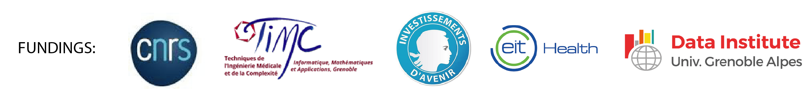

Our group is interested in developing computational methods for a better understanding of genetic and epigenetic variations in the context of cancer.

We are located at [TIMC-IMAG](https://www-timc.imag.fr/) in the [BCM](https://www-timc.imag.fr/BCM) team, CNRS, Université Grenoble Alpes.

[Research projects](research.html)

[Open Science : data Challenges and benchmarking projects](open_science.html)

[People](people.html)

[Publications](publication.html)

[Teaching](teaching.html)

Header Pictures: [Harry Gruyaert](https://www.ecosia.org/images?c=fr&p=13&q=harry+gruyaert#id=_)©

