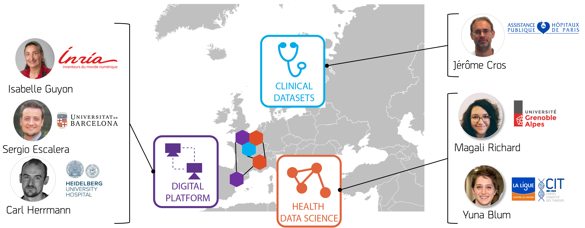

***

# Health data challenge  on  Cancer Heterogeneity

This program targets the current critical need to evaluate novel computational methods and to apply them directly on real health datasets, daily faced by health data scientist and health professionals. As a proof of concept, our project is to generate a benchmarking framework and apply it to the quantification of cell heterogeneity in cancer, though our design will lend itself to a variety of other applications. We provide a digital platform containing statistical methods to be benchmarked and datasets developed by health data scientists, and a web application dedicated to the direct use of these methods on novel clinical datasets provided by health professionals. A 2-day course on the use of the web application will be organised for health professionals.

**Please visit our website dedicate to cancer heterogenity data challenges and benchmarking : [Cancer Heterogeneity](https://cancer-heterogeneity.github.io/)**

### European coordinators 

***

# Data challenge in class

We also organize data challenges within master programs at University Grenoble Alpes.

### 2019: Linear models

[expred challenge](https://competitions.codalab.org/competitions/22422)

### 2018: Logistic regression

[survival challenge](https://competitions.codalab.org/competitions/21360)

