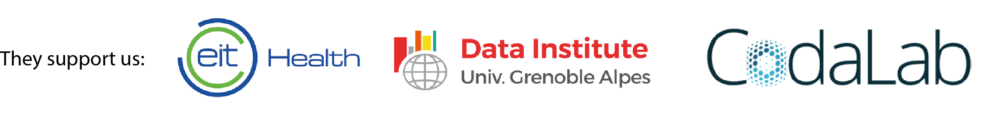

***

# Health data challenge  

## Cancer Heterogeneity

Main collaborators on the codalab platform: I. Guyon (INRIA), S. Escarela (University of Barcelona)

Main collaborators on the computational methods: J. Cros (AP-HP), Y. Blum (Ligue contre le cancer), P. Lutsik (DKFZ)

### 2019

!!! **Next data challenge: November 25 to 29 2019, in Aussois (French Alps)** !!!

### 2018

[Data challenge website](https://data-institute.univ-grenoble-alpes.fr/research/data-science-for-life-sciences/health-data-challenge-matrix-factorization-and-deconvolution-methods-to-quantify-tumor-heterogeneity-in-cancer-research-756672.htm)

[Cancer heterogeneity data challenge](https://competitions.codalab.org/competitions/20850)

## Epigenetic and mediation

Sophie Achard, Dylan Aïssi, Michael Blum, Kevin Caye, Florent Chuffart, Olivier François, Keurcien Luu, Florian Privé and Magali Richard. (2017). 

Retour d’expérience concernant le data challenge épigénétique et médiation à large échelle d’Aussois (2018). [CFIES](http://cfies2017.sfds.asso.fr/). [PDF](data_challenge_CFIES_2017.pdf)

***

# Data challenge in class

### 2019: Linear models

[expred challenge](https://competitions.codalab.org/competitions/22422)

### 2018: Logistic regression

[survival challenge](https://competitions.codalab.org/competitions/21360)

