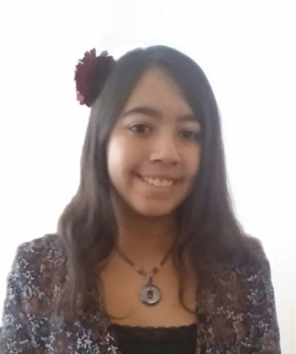
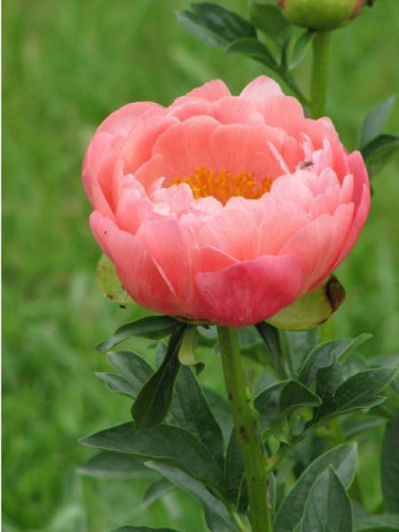
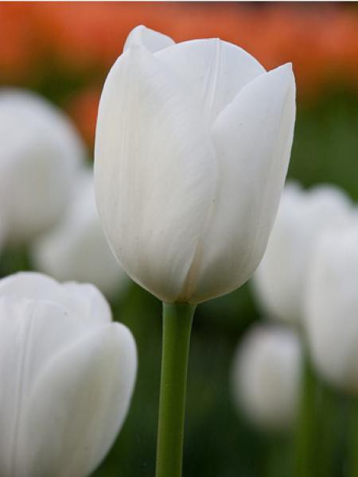

<style>
.column-left{
  float: left;
  width: 20%;
  text-align: right;
}
.column-right{
  float: left;
  width: 80%;
  text-align: left;
}
</style>

<div class="column-left">
```{r, out.width = "100px", echo=FALSE, fig.align='center'}
knitr::include_graphics("pictures/mag_cv.png")
``` 
</div>

<div class="column-right">
**Magali Richard** (PI), for more details, see my [CV](CV.pdf).

Computational biologist specialized in experimental and theoritical genetics. 

CNRS research associate (CRCN), computational biologist

Contact: magali.richard[at]univ-grenoble-alpes.fr

</div>

<div class="column-left">
```{r, out.width = "90px", echo=FALSE, fig.align='center'}

``` 
</div>


<div class="column-right">
**Clémentine Decamps** (co-direction with Daniel Jost, LBMC, ENS Lyon)

Computational biology of cancer epigenetics

PhD student in bioinformatics

Contact: clementine.decamps[at]univ-grenoble-alpes.fr
</div>

<div class="column-left">
```{r, out.width = "80px", echo=FALSE, fig.align='center'}

``` 
</div>


<div class="column-right">
**Yasmina Kermezli** (financed by the EIT Health)

Data challenge & Benchmarking (HADACA and COMETH EIT Health projects)

Postdoc in bioinformatics

Contact: yasmina.kermezli[at]univ-grenoble-alpes.fr
</div>


<div class="column-left">
```{r, out.width = "80px", echo=FALSE, fig.align='center'}
knitr::include_graphics("pictures/slim.png")
``` 
</div>

<div class="column-right">
**Slim Karkar** (financed by the MIAI institute), 

Mutliomic data integration and tumor heterogeneity quantification 

Postdoc in biostatistics

Contact: slim.karkar[at]univ-grenoble-alpes.fr
</div>

<div class="column-left">
```{r, out.width = "80px", echo=FALSE, fig.align='center'}

``` 
</div>

<div class="column-right">

**Fabien Quinquis**

Genetic regulation of tumor heterogeneity

Master 2 internship

Contact: fabien.quimquis[at]univ-grenoble-alpes.fr

</div>


**ALUMNI**

Alexis Arnaud (2020), Engineer, data challenge (financed by the Data institute of grenoble)

Milan Jacobi (2019), Master student, DNA methylation statistical analysis

Bahareh Afshinpour (2019), Engineer, DNA methylation data treatment & analysis

Raphael Bacher (2018), Engineer, data challenge (financed by the Data institute of grenoble)

Arthur Waguet (2018), Master student, Signal treatment & cancer heterogeneity

Paul Terzian (2017), Master student, computational biology of cancer epigenetics


