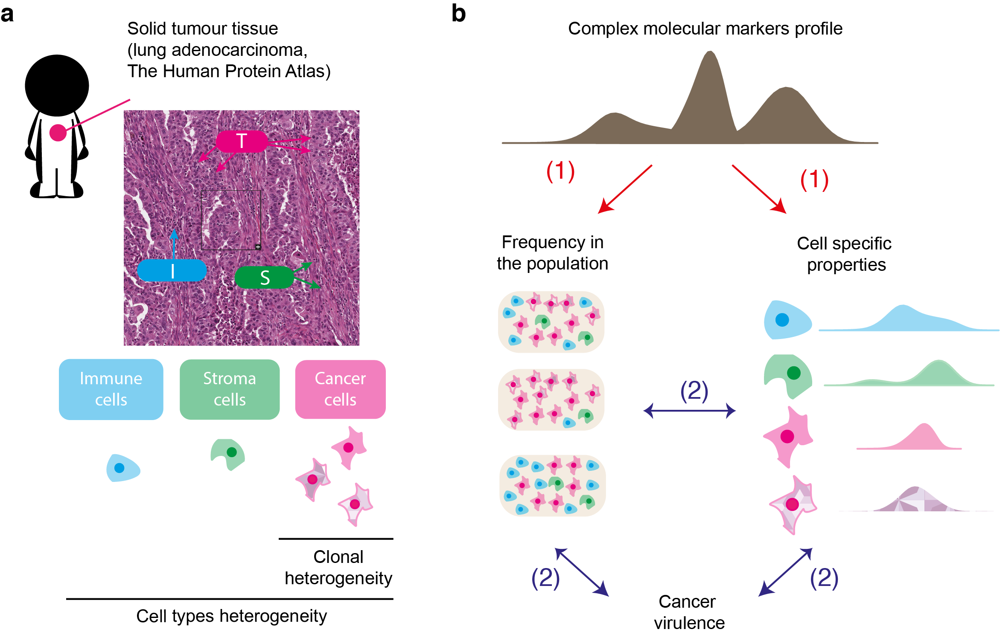
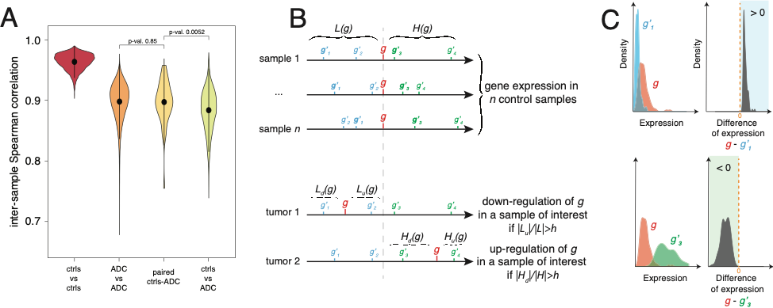

<style>
.column-left{
  float: left;
  width: 33%;
  text-align: left;
}
.column-center{
  display: inline-block;
  width: 33%;
  text-align: center;
}
.column-right{
  float: right;
  width: 50%;
  text-align: right;
}
</style>

***

# Cancer heterogeneity  
main collaborators: Y. Blum, J. Cros, P. Lutsik

<div class="column-right">
```{r, out.width = "300px", echo=FALSE, fig.align='center'}

``` 
</div>

  A major challenge for current research in oncology is to integrate data and existing information into a model that takes into account intra- tumour heterogeneity. Such approach would offer a better understanding of the biological mechanisms involved in the evolution of cancer cells, which will improve the development of adapted therapeutic strategies.

  We address this challenge by establishing an original analytical framework for the study and analysis of complex biological data derived from tumours, and to provide a novel type of information about intra-tumour heterogeneity and cancer virulence.


***

# (Epi)genetic regulation and variability
main collaborators: D. Jost, S. Khochbin, A. Bardet

<div class="column-right">
```{r, out.width = "300px", echo=FALSE, fig.align='center'}

``` 
</div>


  
  Combining statistical analysis and quantitative mathematical modeling with molecular biology experiments on specific cell lines and on tumors, we aim at discovering epigenetically regulated genomic domains in lung cancer, as well as at characterizing and modeling these epigenetic “hot” domains and their association with tumor progression and aggressiveness.


  